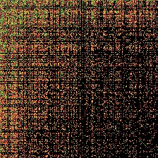

# Malware_Markov_Image-ViT

We intend to implement a malware detection system using Vision Transformer (ViT) and second order Markov images obtained from opcode of the input binary files. 
* **Disassemble:** We obtain the binary code for both malware and benign software samples, and **disassemble** them in **batch process**. 
* **Stochastic Process and 2nd order Markov Matrix:** We consider the disassembled instructions as a stochastic process flow. We define every two adjacent opcodes as a state, and the transition between the two states is actually associated with four adjacent opcodes. More explicitly, a transition can be expressed as: (opcode[i], opcode[i+1])->(opcode[i+2], opcode[i+3]). The Markov matrix of this stochastic process is defined as the **2nd order Markov matrix**, since every state is two opcodes.
* **Opcode Parsing:** We construct a **parser** to extract the most frequently used opcodes and the most frequently appeared states (224 in total, to match with the neural network) in the disassembled files, filtering out all the pseudo-instrucions, registers and data. To construct the image inputs for our neural network, we used the IEEE 754 protocol to map the floating point elements in the matrix to RGB color in the corresponding pixel.
* **Model Trainning:** At last, we train the neural network model. After 30 epochs, the method can have
  * Validation Accuracy:  89.00983146067416%
  * Validation Accuracy For Larger Inputs (1500 non-zero pixels out of 150528 pixels): 92.48417721518987%
  * True Positive Rate: 87.53213367609255%
  * False Positive Rate: 12.467866323907455%
  * True Negative Rate: 90.75369075369075%
  * False Positive Rate: 9.246309246309246%

We Thank [ViT-pytorch](https://github.com/jeonsworld/ViT-pytorch). We are able to utilize the concise code while we add clear annotations for the implementation of ViT, especially focusing on the vicissitude of structure dimension.

## Model Testing

### 1. Download Pre-trained Model

* [Available Models](https://console.cloud.google.com/storage/vit_models/): ViT-B_16(**85.8M**), R50+ViT-B_16(**97.96M**), ViT-B_32(**87.5M**), ViT-L_16(**303.4M**), ViT-L_32(**305.5M**), ViT-H_14(**630.8M**)
  * imagenet21k pre-train models
    * ViT-B_16, ViT-B_32, ViT-L_16, ViT-L_32, ViT-H_14

We simply use ViT-B_16.

### 2. Download Malevis Dataset (Optioinal)

+ [MaleVis Dataset](https://web.cs.hacettepe.edu.tr/~selman/malevis/): We encourage to run the model on this dataset for model testing.

## Preparing Our Own Dataset

This part teaches you to build your own 2nd order Markov image samples from scratch. As you can see, the total repository is not large. This is because we have git-ignored the models and samples. We encourage the reader to build the sample following these instructions.

### 1. Preparing the Binary Files

* [Malware Binaries](https://www.virustotal.com/gui/contact-us): Contact  virustotal for academic reasons, and you can get your malware binaries. In our case, we are doing this detection work on portable executable (PE) files, so please go look for EXEs and DLLs. Please create a folder named "binary" under the "malware" directory and put the binaries you collected there.
* **Benign Binaries:** We did not go for online datasets. Instead, we wrote a script (benignware/benign.py) to extract all the EXEs and DLLs with reasonable size (100kB~3MB, if the file is too large, later process will take too long). Before running the script, please create a folder named "binary" under the "benignware" directory. Make sure that the benign binaries and the malware binaries are approximately equal in numbers. We used 5034 benign softwares and 5177 malwares.

### 2. Disassembling the Binaries

* **Download IDA Pro:** We highly recommend to download this tool. Because it supports multiple platform and instruction sets.
* **Batch Processing:** If we want to automate the disassembling process, we wrote two scripts (benignware/asm_gen.py and malware/asm_gen.py, these two are identical) to disassemble files in batches. The command for disassembling a single file is
```
ida64 -B -TPortable [the file you want to disassemble]
```

### 3. Parsing the Files

* **Statistics of Opcode and Markov State Frequencies:** There are many opcode, and apparently more Markov states (every two opcodes). How do we fit them in the 224\*224\*3 input of the neural network? We do this by only selecting the most frequently used 224 opcodes and states. You can randomly select several malware and benign software binaries and form a sampling subset. Run the **parser** on the subset and count the frequencies.
* **Parser:** The parser's input is a disassembled PE file, it extract the opcodes and states, and calculate the 2nd order Markov matrix, and eventually output the Markov image. The elements in the matrix are float32 data types. If we convert the matrix (32 bit per element) to a image (8\*3 channels = 24 bit per pixel), some truncations must be made. According to IEEE 754, leaving out the last 8 bits won't leave significant changes to a floating point number. So we simply cut out the least significant 8 bits. There are two parsers (all named parse2.py) in both the "malware" folder and the "benignware" folder. Create "img2" folders in both "malware" and "benignware" directory, so that the images can be fall in place. If you see pure blue images in rare occasions, just remember that they are the result of some disassembly files with pure data and no opcodes, and you can delete them.

### 4. Input Sampes
You cannot really classify the benign software from the malware with your bare eyes though. They look very much alike.


## Training and Validation

### 1. Train
The training script is train.py. We run 30 epochs on the dataset. We use cosine annealing schedule to adjust the learning rate.
```
python train.py --test False --trainingSet_dir [trainingSet_dir] 
```

### 2. Test

```
python train.py --test True --testingSet_dir [testingSet_dir]
```

## Reference

[ViT-pytorch](https://github.com/jeonsworld/ViT-pytorch)

## Citation

```bibtex
@article{Markov,
  author = {zhongMou-lilSister, One-punch24},
  title = {Using Second Order Markov Matrix Obtained From Opcode Sequence For Malware Detection},
  year = {2021},
  publisher = {GitHub},
  journal = {GitHub repository},
  howpublished = {\url{https://github.com/One-punch24/Malware_Markov_Image-ViT}},
}
```

